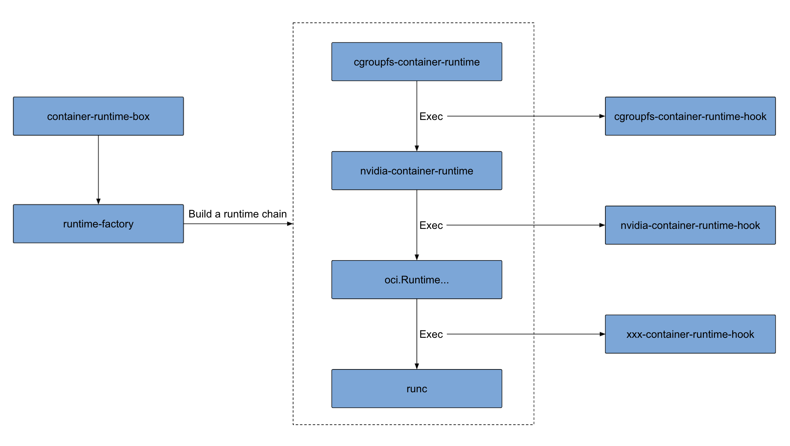

# container-runtime-box
`container-runtime-box` is used to assemble different oci runtime wrapper into a chain so that different oci runtime wrapper can implement their own logic, such as weaving into hook, before calling runc.
## Architecture

## How to build
```
$ go build -o /usr/bin/container-runtime-box cmd/main.go
```
## How to work
```
$ cp samples/config.toml /etc/container-runtime-box/config.toml
$ cp samples/docker-daemon.json /etc/docker/daemon.json
$ systemctl restart dockerd
```